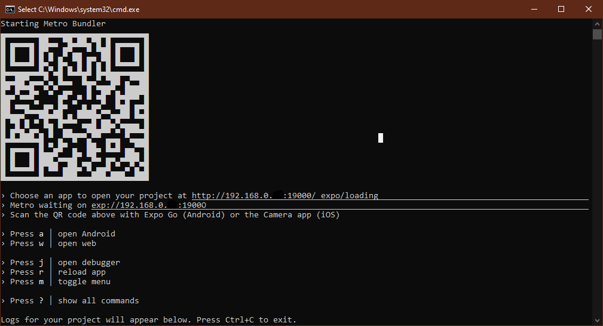
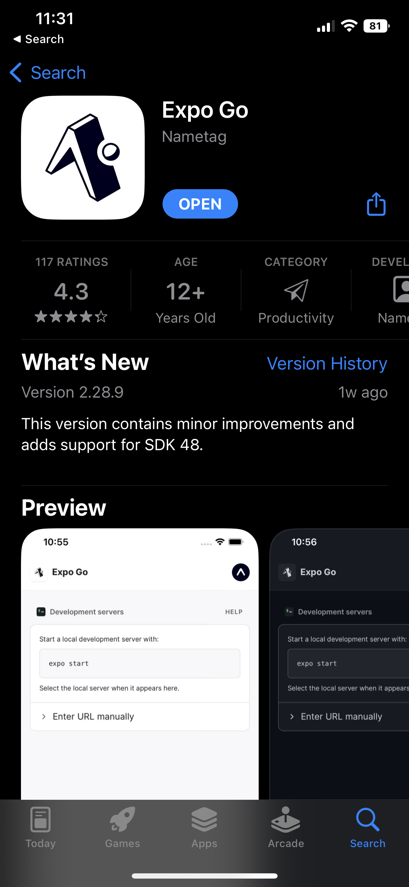
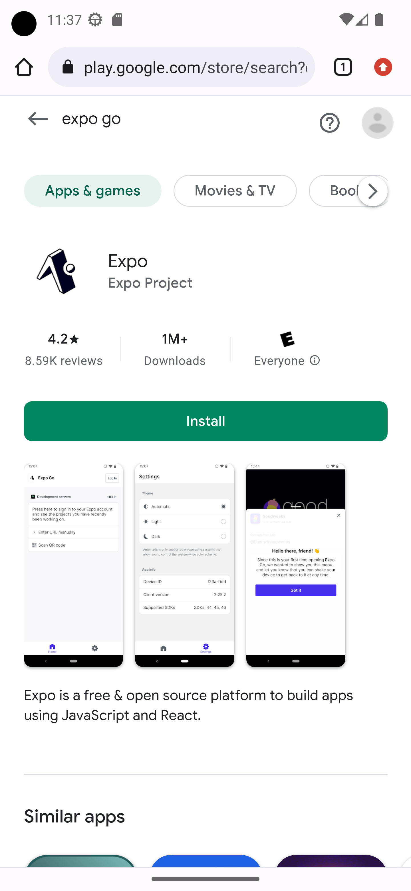
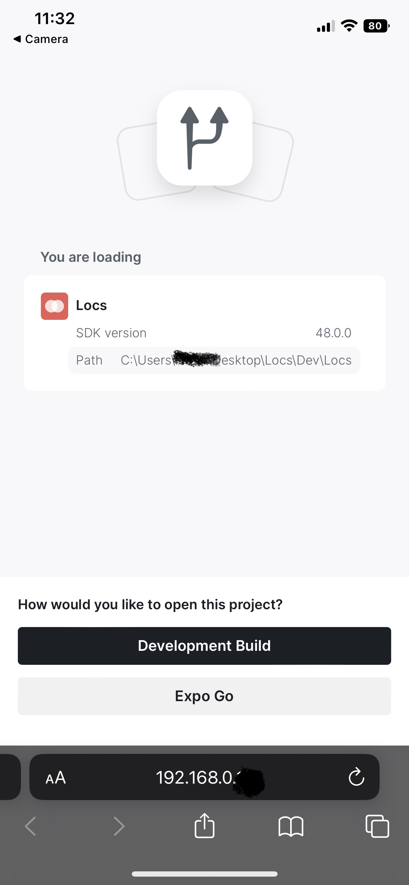

# Locs

Discutez, partagez et échangez avec eux.

Que ce soient des photos, de la musique ou vos pensées, notre réseau social permettra à un utilisateur de parler dans le chat public de sa localisation.

De plus, votre identité est anonyme jusqu'au moment d'accepter l'échange d'information avec un autre utilisateur.

Dites maintenant adieu à l'ennui et bonjour aux nouvelles connexions avec LOCs.

## Installation

Pour pouvoir tester l'application il faudra soit avoir un Emulateur android ou iphone selon votre ordinateur.

Vous pouvez installer celui d'android studio sur ce lien : https://developer.android.com/studio et ainsi créer un émulateur.

Pour que l'application marche, il faut rouler deux lignes de commandes visées sur deux endroits:

```bash
cd ./Locs/dev/Locs
cd ./Locs/dev/Locs/server
```

Dans les deux lignes de commandes, il faut run

```js
npm install
```

Ensuite dans le premier, il faut run:

```js
npx expo start
```

Dans le deuxieme, il faut run:

```js
nodemon api
```

Voilà! l'application et fonctionnelle
Il faudra maintenant seulement scanner le code QR et ce dernier roulera sur Android et iOS!
Vous pouvez également appuyez sur le bouton a pour open Android tout en ayant l'émulateur allumer pour ainsi demarrer l'application sur l'émulateur

## Mise en Garde
Il faudra également mettre l'ip de votre ordinateur dans le fichier constnames.js qui est dans locs/dev/locs/components pour pouvoir utiliser notre application
Car le serveur n'est qu'un serveur local et doit utiliser votre ip pour ainsi instancier le serveur.






## Utilisation

Quand l'application est ouverte, elle ouvre sur la page de connexion

#### Login et Register
Cette dernière vous donne l'option de s'enregistrer ou de se conecter
Dans Register, vous devez vous créer un compte avec un courriel et un mot de passe.
Ensuite, vous avez l'option de personnaliser votre compte pour ceux qui vous ont dans leurs liste de ***deLoc***

#### Autour de vous
Ensuite vous allez atterir sur ChatAutour,
Cette page vous affiche les **locations** autour de vous,
Vous pouvez augmenter le radius de recherche pour agrandir la liste de location, chaque location vous dira si vous êtes assez proche pour avoir le droit de bavarder avec le monde présent.

#### Chatroom
En cliquant sur une des **locations**, ceci ouvrira son chatroom. Chaque chatroom affiche une petite description de l'établissement. Si vous ne pouvez pas bavarder, il affichera seulement les chats, sinon vous avez le droit de parler et d'ajouter du monde dans votre liste de ***deLoc***. Vous avez aussi le droit d'ouvrir un chat privée avec quelqu'un de spécifique.

#### Location
Sur cette page, vous pouvez recherchez des Points d'intêrets pour voir les conversations a l'éxterieur de la limite de radius similairement à _SnapMap_. Avec la barre de recherche, vous pouvez trouvez specifiquement un **location**. Apres avoir selectioné un endroit, juste cliquez sur le marqueur et cela ouvrira son chatroom

#### Profile
Ici, vouz pouvez voir les informations de votre compte et votre liste de ***deLoc***, ainsi qu'un bouton qui ouvrent vos chats privées

## Références
Voici quelques référence qu'ont a utilisée pour programmer **Locs**:
* [React Navigation](https://reactnavigation.org/docs/getting-started/)
* [Google Maps Places API](https://developers.google.com/maps/documentation/javascript/places)
* [React](https://react.dev/learn)
* [Expo](https://docs.expo.dev/)
* [MongoDB](https://www.mongodb.com/docs/)
* [MongoDB pour React Native](https://nabendu82.medium.com/react-native-project-with-nodejs-and-mongodb-part-1-443cc5b65b46)

## Dependances
### Application
[react-native-maps](https://github.com/react-native-maps/react-native-maps)
[react-native-google-maps-autocomplete](https://www.npmjs.com/package/react-native-google-places-autocomplete)
[@react-navigation](https://github.com/react-navigation/react-navigation)
* @expo-google-fonts/galdeano
* @expo/vector-icons
* @react-native-async-storage/async-storage
* @react-native-community/datetimepicker"
* @react-native-community/geolocation
* @react-native-community/slider
* @react-navigation/bottom-tabs
* @react-navigation/material-top-tabs
* @react-navigation/native
* @react-navigation/native-stack
* expo-app-loading
* expo-fast-image
* expo-file-system
* expo-font
* expo-image-picker
* expo-location
* expo-status-bar
* expo-task-manager
* file-type
* jwt-decode
* local-ip-address
* react-native-date-picker
* react-native-dropdown-select-list
* react-native-expo-image-cache
* react-native-fast-image
* react-native-file-type
* react-native-fs
* react-native-image-base64
* react-native-image-to-base64
* react-native-modal-datetime-picker
* react-native-network-info
* react-native-safe-area-context
* react-native-screens
* strtok3

### Serveur
* [bcrypt](https://www.npmjs.com/package/bcrypt)
* [body-parser](https://www.npmjs.com/package/body-parser)
* [express](https://www.npmjs.com/package/express)
* [jsonwebtoken](https://www.npmjs.com/package/jsonwebtoken)
* [mongoose](https://www.npmjs.com/package/mongoose)
* [ngrok](https://www.npmjs.com/package/ngrok)

## Team
* [Lemar Andar](https://github.com/Nicaus): Gros developpeur Frontend!
* [Rayane Rachid Kennaf](https://github.com/qRayne): Fou developpeur Backend!
